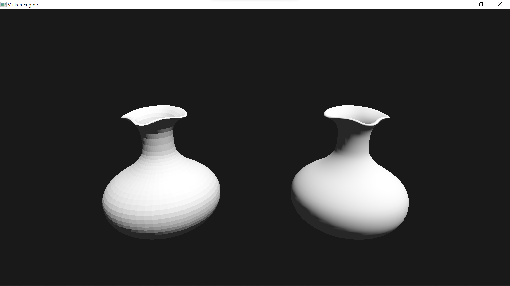

# Vulkan Engine

🚧Work in progress🚧

The tutorial that this repo is based on: [Link](https://www.youtube.com/playlist?list=PL8327DO66nu9qYVKLDmdLW_84-yE4auCR)


Tutorials on how to install and use vcpkg with Vulkan:
- https://www.youtube.com/watch?v=xYN3J13rjhM
- https://www.youtube.com/watch?v=pSirBt4OgXQ

Install vcpkg in "C:\dev\vcpkg" following this guide:
- https://github.com/microsoft/vcpkg

Install the following:
```bash
.\vcpkg\vcpkg install vulkan:x64-windows
.\vcpkg\vcpkg install glfw3:x64-windows
.\vcpkg\vcpkg install glm:x64-windows
```

Run this to integrate with Visual Studio:
```bash
.\vcpkg\vcpkg integrate install
```

Compile the shaders in the vulkan-engine directory:
```bash
cd vulkan-engine
compile.bat
```

Run cmake command with this flag or add the address as the CMake toolchain file in Visual Studio:
```bash
-DCMAKE_TOOLCHAIN_FILE=C:/dev/vcpkg/scripts/buildsystems/vcpkg.cmake
```

Maybe helpful:
- https://www.40tude.fr/how-to-use-vcpkg-with-vscode-and-cmake/


Current state:


